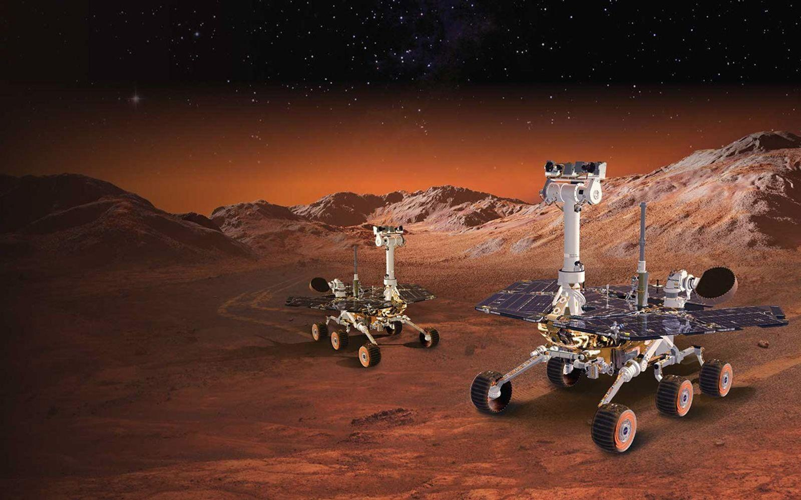

# Mission ARES: The Mars Rover Rendezvous

**Two rovers. One mission. One shared program.**

## Mission Background

The year is 2042. Humanity has launched **Mission ARES**, an ambitious robotic exploration program designed to investigate the surface of Mars.

Instead of sending one large rover, mission engineers developed an innovative solution: two smaller autonomous rovers, **ARES-1** and **ARES-2**, that can travel independently and physically dock together to assemble a larger, more capable exploration vehicle.

Unfortunately, during atmospheric entry, a navigation malfunction caused the two landing modules to separate unexpectedly. Both rovers landed safely using their parachutes, but at different locations.

Their parachutes remain on the Martian surface, providing detectable navigation landmarks.

There is another complication: the rovers' precise landing coordinates are unknown, and communication with Earth suffers from significant delays. Direct remote control is therefore impossible.

Fortunately, both rovers carry identical programmable CPUs. Mission Control can upload a single program that both rovers will execute independently.

## Your Mission

You are the software engineer responsible for writing the autonomous rendezvous program.

Your objective is to guide both rovers toward each other until they meet and successfully dock, forming the larger ARES exploration rover.

However, there are strict engineering constraints:

- Both rovers must execute **exactly the same program**.
- Neither rover knows its absolute position or the position of the other rover.
- The rovers cannot communicate with each other.
- Each rover has access only to its limited onboard sensors and CPU instructions.
- The program must work regardless of their initial landing positions.

## The Challenge

**Can you write a single program that guarantees both rovers eventually meet?**

> **MISSION CONTROL — AWAITING PROGRAM**  
> Upload your instructions, run the simulation, observe the rovers' behavior, and verify your solution across different landing configurations.

**Mission success condition:** Both rovers reach the same location and initiate docking.

*Remember: Your task is not to control two robots individually. It is to design one algorithm that allows two independent machines to coordinate without communicating.*

---

**Created by Muhammad Z** · [github.com/tryfinally](https://github.com/tryfinally)
